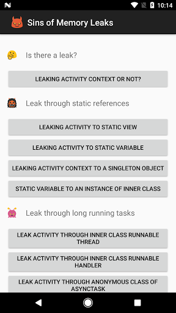

# Sins of Memory Leaks
This app shows common patterns of memory leaks in Android development and how to fix them.

*Warning:* this app contains various memory leaks. It is intended for Android developers' study purpose only. The author does not take any responsibility for any potential damage to your devices.

I am going to write an artical about the examples in this app. Stay tuned in this space...
