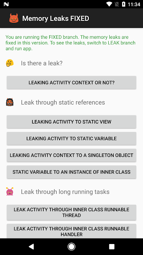

# Sins of Memory Leaks
This app shows common patterns of memory leaks in Android development and how to fix them. LEAK branch has the code which has memory leaks. These memory leaks are fixed in FIXED branch.

LEAK Branch                |  FIXED Branch
:-------------------------:|:-------------------------:
  |  

## Build
Two branches have different app ids which allow them to co-exist on the same device or emulator.

##Warning
This app contains various memory leaks. It is intended for Android developers' study purpose only. The author does not take responsibility for any potential damage to your devices.

I am going to write an artical about the examples in this app. Stay tuned in this space...
